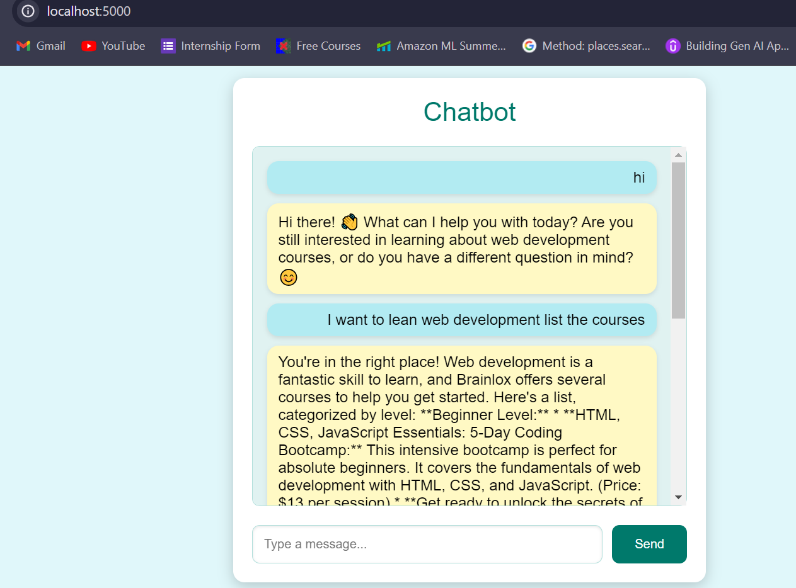

# Chatbot Application

This repository contains a Flask-based chatbot application that leverages the LangChain library to provide intelligent responses based on context. The chatbot can use either OpenAI's GPT-3.5-turbo or Google's Gemini-1.5-flash models for generating responses.

## Features

- Flask web server to handle chat requests.
- Integration with LangChain for advanced conversational AI capabilities.
- Supports both OpenAI and Google Generative AI models.
- Uses FAISS for efficient document retrieval.
- Chat history management for context-aware responses.

## Prerequisites

- Python 3.7+
- Flask
- LangChain
- FAISS
- dotenv

## Installation

1. Clone the repository:

    ```bash
    git clone https://github.com/kshitijkumrawat20/Chatbot_using_langchain.git
    cd Chatbot_using_langchain
    ```

2. Create a virtual environment and activate it:

    ```bash
    python -m venv venv
    source venv/bin/activate  # On Windows use `venv\Scripts\activate`
    ```

3. Install the required packages:

    ```bash
    pip install -r requirements.txt
    ```

4. Create a `.env` file in the root directory and add your API keys:

    ```plaintext
    GOOGLE_API_KEY=your_google_api_key
    OPENAI_API_KEY=your_openai_api_key
    ```

## Usage

1. Run the Flask application:

    ```bash
    python app.py
    ```

2. Open your web browser and navigate to `http://127.0.0.1:5000/`.

3. Use the chat interface to interact with the chatbot.

## Project Structure

- `app.py`: Main application file containing the Flask server and chatbot logic.
- `templates/index.html`: HTML template for the chat interface.

## Screenshot



Feel free to contribute to this project by opening issues or submitting pull requests. Happy coding!
